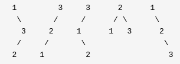

https://leetcode-cn.com/problems/unique-binary-search-trees-ii/

## 95. Unique Binary Search Trees II

Given an integer n, generate all structurally unique BST's (binary search trees) that store values 1 ... n.

**Example**:

**Input**: 3

**Output**:

[ 
  [1,null,3,2], 
  [3,2,null,1], 
  [3,1,null,null,2], 
  [2,1,3], 
  [1,null,2,null,3] 
]

**Explanation**:

The above output corresponds to the 5 unique BST's shown below:

## 95. 不同的二叉搜索树 II

给定一个整数 n，生成所有由 1 ... n 为节点所组成的 **二叉搜索树** 。

 

**示例**：

**输入**：3

**输出**：

[ 
  [1,null,3,2], 
  [3,2,null,1], 
  [3,1,null,null,2], 
  [2,1,3], 
  [1,null,2,null,3] 
]

**解释**：

以上的输出对应以下 5 种不同结构的二叉搜索树：

## 解题思路 -- 递归

从第一眼看去，该题需要使用循环去遍历所有的可能情况。因为二叉搜索树的子树也一定为二叉搜索树，故其实相当于整个二叉搜索树可以划分为多个子二叉搜索树的排列组合。这样看来，该题目可以使用递归的方式生成某个根节点的左右子树，再根据左右子树的个数进行排列组合来生成当前根节点下的二叉搜索树。

**步骤**

1. 判定边界值

    因为当前生成的节点树为1到n而不是0到n，故初始的left和right值为1和n

2. 叶子节点条件

    因为叶子节点是最终状态，故成形叶子节点的条件就变得更为重要。在当前的判定条件中我们可以知道，当left等于right时，相当于只有一个点，故不会再有下一个子树成形，故left等于right为叶子节点的条件。

    除此之外，因为遍历时可能存在left大于right的情况，举个例子，当i为right的时候，右子树的传入参数为i+1和right，则新的left为i+1，其大于right，不能形成二叉搜索树，故需要Null来表示当前节点并无数据，故另一个条件为left大于 right时，返回Null表示当前节点不存在。

3. 遍历1-n，并合并左右子树

    上边步骤已经将叶子节点和null节点的情况的条件列出，该步骤则需要遍历1-n作为根节点时对应的树的情况。

    通过递归已经得到当i为根节点时，其左右子树的全部情况，故将左右子树进行排列组合合并成一个个以i为根节点的二叉搜索树即可。