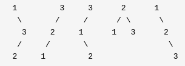

## 96. Unique Binary Search Trees

Given n, how many structurally unique BST's (binary search trees) that store values 1 ... n?

Example:

Input: 3

Output: 5

Explanation:

Given n = 3, there are a total of 5 unique BST's:

## 96. 不同的二叉搜索树

给定一个整数 n，求以 1 ... n 为节点组成的二叉搜索树有多少种？

示例:

输入: 3

输出: 5

解释:

给定 n = 3, 一共有 5 种不同结构的二叉搜索树:

## 名词解释-二叉搜索树

**二叉查找树**（英语：Binary Search Tree），也称为**二叉搜索树、有序二叉树**（ordered binary tree）或**排序二叉树**（sorted binary tree），是指一棵空树或者具有下列性质的二叉树：

- 若任意节点的左子树不空，则左子树上所有节点的值均小于它的根节点的值；
- 若任意节点的右子树不空，则右子树上所有节点的值均大于或等于它的根节点的值；
- 任意节点的左、右子树也分别为二叉查找树；

## 解法：动态规划

假设G(n)表示在n个节点时存在的二叉搜索树的个数，F(i)表示以i为根节点的二叉搜索树的个数，则

$$ G(n) = \sum^n_{i = 1} F(i) $$

当i为根节点的时候，左子树节点个数为i-1, 右子树节点个数为n-i, 则

$$ F(i) = G(i - 1) * G(n - i)$$

通过链式法则，将F(i)带入到第一个公式中, 则

$$ G(n) = \sum^n_{i = 1} G(i - 1) * G(n - i) $$

通过python将该公式实现即可得到最终结果。Python实现请看 uniqueBST.py。

